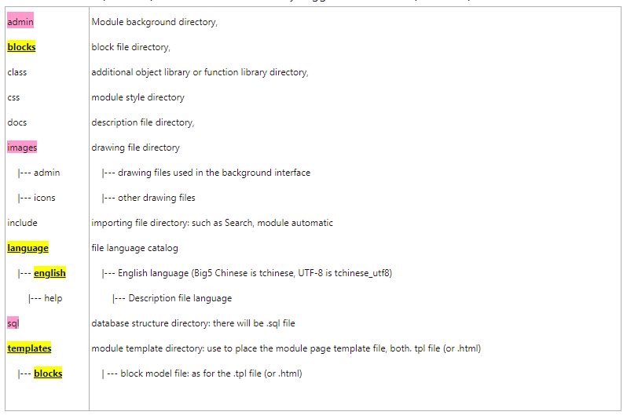

# 1-2 Download XOOPS250ModuleConversionFiles

1. [XOOPS250ModuleConversionFiles](https://campus-xoops.tn.edu.tw/uploads/tad_book3/file/29/XOOPS250ModuleConversionFiles_20170707.zip) is the official basic module structure, but the downloaded version has been optimized to support PHP7 and XOOPS 2.5.8 and above, and supports all versions of bootstrap. Therefore, it is recommended to use this version to develop easier . 
2. A XOOPS module is a directory, this directory will be placed under modules, please modify the directory name, for example: tad\_signup. 
3. Below is the new \(after 2.5\) XOOPS module directory suggested structure \(PHP&gt; 5.3\):

1. **Bold and underlined** directories \(if this function is useful\) must be present, and directory names cannot be changed randomly!

